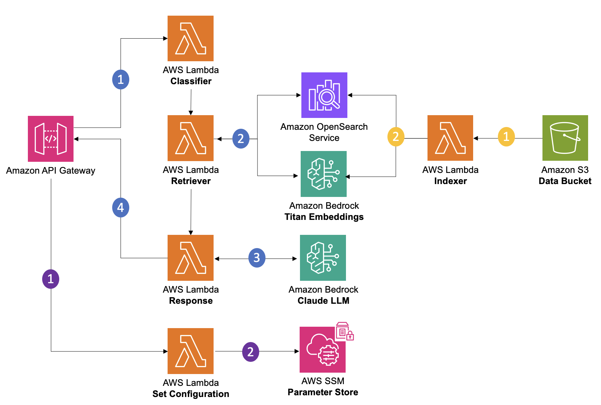

# Generative AI - Sample ChatBot Implementation using RAG Framework

This project creates the backend for a Generative AI ChatBot that leverages a RAG framework for providing additional context to the LLM. The solution contains the source code and supporting files for a serverless application that that you can deploy using the SAM CLI. 

To learn more about RAG Frameworks and the AWS SAM CLIs please see the following links:
- [Retrieval Augmented Generation (RAG)](https://docs.aws.amazon.com/sagemaker/latest/dg/jumpstart-foundation-models-customize-rag.html)
- [SAM CLI](https://docs.aws.amazon.com/serverless-application-model/latest/developerguide/what-is-sam.html)

## Architecture

The solution will deploy the following resources:

The solution contains 3 main processes:

 **I. Set Configuration** (*purple*) - *sets the parameters that will be referenced by the Lambda functions. If no request is made, default values will be used*
  1. Application Developer makes API call to the */setConfiguration* method in **Amazon API Gateway** with their specified parameters. Sample request bodies and defined parameters can be found in the *./events* folder.
  2. This will call the **Set Configuration Lambda** that will take in the updated parameters and store them in **AWS SSM Parameter Store** to be referenced in other Lambda Functions throughout the solution.

  **II. Document Upload and Embedding** (*yellow*) - *adds context to the LLM*
  1. Application Developer uploads contextual files to **Amazon S3**.
  2. Amazon S3 triggers the **Indexer Lambda** that will call the **Amazon Bedrock Titan Embedding Model** and store the embeddings of that file in **Amazon OpenSearch Service**. To learn more about Embeddings please see the following link: [What are Embeddings in Machine Learning](https://aws.amazon.com/what-is/embeddings-in-machine-learning/)

 **III. ChatBot** (*blue*)
  1. End User makes an API request to the */classification* method in  **Amazon API Gateway**. Sample request bodies can be found in the *./events* folder.
  2. The **Classifer Lambda** will take the question passed by the user and extract the keyword that matches the indices created by the Index Lambda. The response of this lambda will be a JSON with the question and the index extracted from it and passed to the Retriever Lambda. 
  3. The **Retriever Lambda** is triggered which will take the initial user input and the index (classification) to retrieve the relevant document embeddings from **Amazon OpenSearch Service**.
  4. The initial user input and relevant documents are used to format the request to **Amazon Bedrock - Claude LLM**, which is made in the **Response Lambda**. The response is then formatted and sent back to the end user.

  > **Note**: The Lambda functions are stiched together by the Classification Lambda. In other words, when a request is made to the Classifier, the Retriever and Response will automatically be called and the API response will be the final answer from the LLM. This feature is enabled by the **OPERATION_MODE** environment variable being set to **INCLUSIVE** in the SAM template. To disable, change the value to **DISABLE**.

## Deploying the Application
This application is configured to be deployed on top of the **AWS Generative AI** Environment Provider. Once your environment is configured, you can follow the steps in the software template to deploy your AWS Gen AI Chatbot via the GLENT on AWS UI.

## Interacting with the Application
To interact with the backend of the application, you need to do so in the following order:

As an Application Developer:
1. **Setting Configuration Parameters** - To set the parameters that are used in the application, see **./events/set-configuration**. For more information on parameter definitions, please visit the full documentation on the [GLENT on AWS](https://glentonaws.io/) website.
2. **Uploading Contextual Documents** - To upload relevant documents you need to go into your S3 **Data Bucket** and upload files there. The name of this bucket can be found on the Entity Page of your application, under AWS Infrastructure Resources, listed as an S3 bucket with the following naming convention: **{app-name}-{env-prov}-databucket-xxxx**. Simply upload a document and wait for the indices to be created in OpenSearch. (Note: This solution only supports .txt files)
3. **Testing** - To test the Classifier, Retriever and Response Lambda functions, see the corresponding files **./events/{function-name}**

End User
1. **Asking the ChatBot a Question** - To ask a question, simply make an API call to the Classfication API method using the request format found in **./events/classification**

